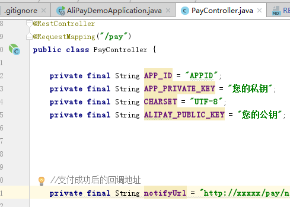
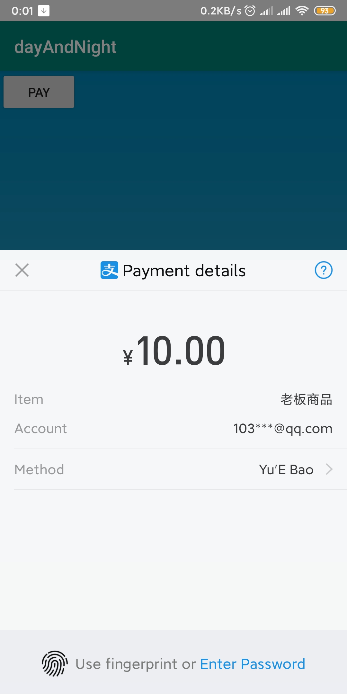

# aliPay-demo
aliPay-demo

- 支付宝app支付服务端: https://github.com/1030907690/aliPay-demo
- 支付宝app支付客户端: https://github.com/1030907690/aliPay-client-demo

#### 一、服务端代码
- 先到PayController替换APP_ID、APP_PRIVATE_KEY、ALIPAY_PUBLIC_KEY、notifyUrl

- main方法运行AliPayDemoApplication
- 支付回调的处理我预留起的
#### 二、客户端代码
- 具体操作步骤可查看官方文档: https://docs.open.alipay.com/204/105296/ ,从导入支付宝 SDK步骤开始看起;需要导入包,加权限。
- 主要业务代码在MainActivity,要修改下单地址中间的域名(或ip);支付回调需要公网域名.

#### 四、最终效果
